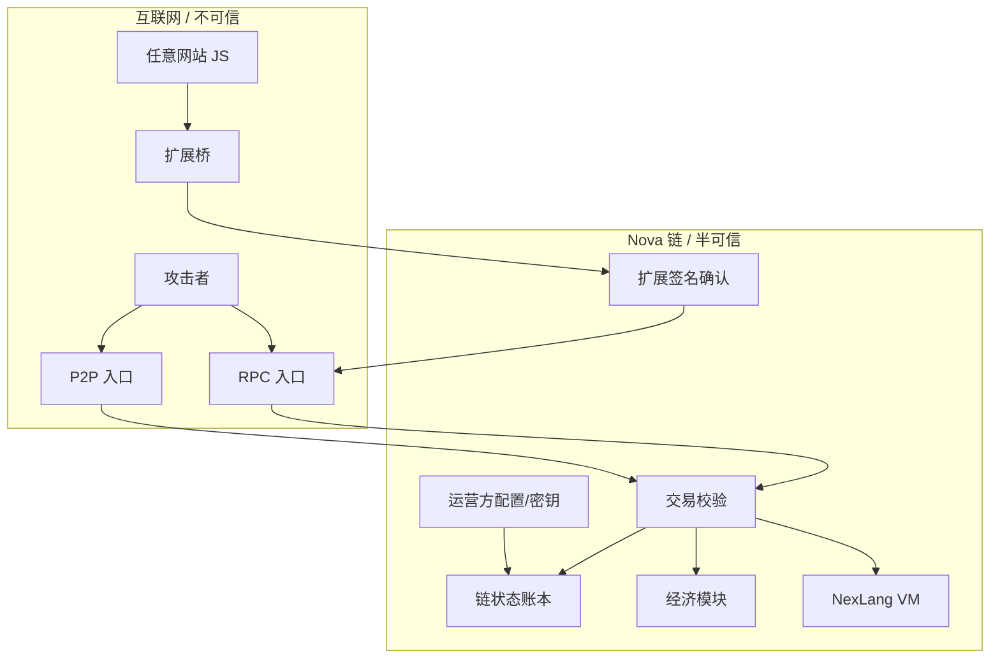

# Nova 链威胁模型（novachain + novachain-web）

> 依据 `security-threat-model` 技能流程产出；范围覆盖 `C:\Users\Administrator\novachain`（节点/共识/经济/VM）与 `C:\Users\Administrator\novachain-web`（前端/扩展/SDK）。所有结论以仓库代码为证据锚点；未确认项已显式标注为假设/开放问题。

## Executive summary

Nova 是一条 Python 实现的 PoS/checkpoint 双模式公链，攻击面集中在三层：**公网 RPC**（aiohttp，无鉴权、CORS 全开）、**P2P 网络**（自签名 TLS、快照同步）、**钱包前端/扩展**（私钥落 localStorage、桥接注入所有站点）。最高风险主题是**经济完整性**（铸造、基金、奖励刷量）与**用户钱包安全**。上一轮已修复两个严重项（0x0000 任意铸造、P2P 快照接管），当前最突出的残余风险是 PoS 补块可被恶意利用、AI 成长基金单监护人可提空、以及钱包私钥明文存储。

## Scope and assumptions

- 在范围内：`novachain` 运行时（nova_node.py、network/*、core/*、agent/*、scripts/*）、`novachain-web` 前端页面、browser-extension、sdk。
- 不在范围内：CI/构建流程、测试用例本身（作为证据引用除外）、第三方 CDN 资产完整性（仅备注）。
- 假设（用户已确认“按假设来”）：
  1. 节点当前以开发/演示为主：默认 checkpoint 共识、TLS 自签名、RPC 监听 `0.0.0.0`，生产 PoS 模式尚未正式上线。
  2. 链上代币具有经济价值（总供应 8100 万，含空投/质押/奖励），经济类威胁按最高风险看待。
  3. RPC 无外部鉴权，靠签名交易+IP 限流；无签名端点若暴露公网即视为公网可触达。
  4. 前端 Vercel 静态站+浏览器扩展面向普通用户，钱包私钥安全是用户侧主要风险。
  5. AI 创作者/Agent 私钥由运营方托管（阶段 0/1），链上日预算硬约束兜底。
- 开放问题（影响排序，未答复）：
  - RPC/P2P 是否直接暴露公网、是否有前置网关（Nginx/WAF）？
  - 代币/激励当前是真实价值还是演示阶段？预期用户/节点规模？
  - 是否启用多节点快照同步、受信种子集合如何维护？

## System model

### Primary components

| 组件 | 职责 | 证据锚点 |
| --- | --- | --- |
| Nova 节点 | RPC 入口 + 交易流水线（validate/apply）+ 状态持久化 | `nova_node.py`（NovaNode） |
| 网络层 | aiohttp RPC 路由、CORS 中间件、P2P 帧协议、限流/重放防护 | `network/rpc.py`、`network/p2p.py`、`network/security.py` |
| 共识引擎 | checkpoint/PoS 双模式出块、补块、罚没 | `core/consensus.py` |
| 经济与业务模块 | 质押/空投/存储/算力/SocialFi/AI 基金/仲裁 | `core/economy.py`、`core/socialfi.py`、`core/ai_service.py`、`core/compute.py`、`core/storage*.py`、`core/arbitration.py` |
| NexLang VM | 字节码执行（PUSH/STORE/SEND/RET） | `core/vm.py`、`nexlang_compiler.py` |
| 密码学 | Ed25519/Dilithium5 签名、P-256 ECIES 密文 | `core/crypto.py` |
| 聊天中继 | 端到端加密信箱（只存密文+元数据） | `core/chat.py` |
| Agent 运行时 | 运营方托管的链上创作者（LLM/Mock 内容引擎） | `agent/*` |
| 前端控制台 | 静态 HTML+JS 钱包/应用页 | `novachain-web/*.html`、`apps-common.js`、`nova.html` |
| 浏览器扩展 | DApp 桥、popup 确认、本地钱包 | `browser-extension/*` |
| SDK | 页面与扩展桥接 | `sdk/nova-wallet-sdk.js` |

### Data flows and trust boundaries

- 互联网攻击者 → RPC：HTTP JSON；无鉴权；仅 IP 限流 100 次/秒（`network/security.py`）；CORS `*`（`network/rpc.py:5-19`）。签名操作以链上签名交易为准，无签名端点（checkin/referral/light_verify）无任何所有权证明。
- 互联网攻击者 → P2P：TCP JSON 行帧；TLS 自签名且客户端 `CERT_NONE`（`network/p2p.py:30-37`）；快照同步默认关闭、仅受信种子可开（已修复 C-02）。
- 用户浏览器 → 前端静态站 → RPC：JSON；前端私钥存 `localStorage`（`nova.html:742`）。
- 任意网站 JS → 扩展桥：`window.postMessage`；content script 注入所有站点（`browser-extension/manifest.json:18-21`）；签名动作进 popup 队列确认。
- 运营方 → 节点：CLI 参数/配置文件/验证者私钥/Agent 私钥；无运行时保护（本地文件）。
- Agent 运行时 → 链：经 RPC/本地网关提交签名交易；预算由链上 `ai_can_spend` 兜底。

#### Diagram

## Assets and security objectives

| 资产 | 为什么重要 | 安全目标 (C/I/A) |
| --- | --- | --- |
| 代币余额/账本 | 全链价值载体 | I（完整性优先） |
| 质押/解押/奖励池（ECOSYSTEM_FUND、VALIDATOR_POOL、AI_FUND、TEXT_ESCROW、COMPUTE_POOL） | 激励与治理资金 | I/A |
| 钱包私钥（前端 localStorage、扩展、Agent/验证者密钥） | 资产控制权 | C（机密性） |
| 链状态文件（chain_state.json、chat 文件） | 账本持久化 | I/A |
| 用户内容/密文资产 | 创作者收入与隐私 | C/I |
| 节点可用性（RPC/P2P） | 全链可用性 | A |

## Attacker model

### Capabilities

- 远程无鉴权：访问全部 RPC 端点、连接 P2P、读取公开链状态。
- 可低成本批量创建地址/钱包（无成本或仅空投成本）。
- 可运行恶意对等节点参与 P2P 消息与（若开启）快照同步。
- Web 侧：可在任意网站执行 JS（扩展注入），可跨站调用公网端点，可读写 `nova.html` 同源 localStorage。
- 运营侧：不控制运营方配置文件、种子列表、验证者/Agent 私钥（除非本地沦陷）。

### Non-capabilities

- 无法伪造有效链上签名（假设 Ed25519/Dilithium5 实现正确；自定义 Ed25519 存在可塑性残余风险 TM-011）。
- 无法在固定证书校验下中间人 TLS（当前自签名+CERT_NONE 意味着不满足此前提，TM-013）。
- 无法改写已上链且被节点持久化的账本（除非利用 C-02 类快照接管，已默认关闭）。

## Entry points and attack surfaces

| 表面 | 触达方式 | 信任边界 | 备注 | 证据 |
| --- | --- | --- | --- | --- |
| RPC HTTP `/api/*` | 公网/内网 HTTP | 互联网→节点 | 无鉴权；限流 100/s/IP | `network/rpc.py` |
| 无签名端点 checkin/referral/light_verify | 公网 HTTP | 互联网→节点 | 无所有权证明 | `nova_node.py:1088/1099/1147` |
| P2P TCP | 任意节点连接 | 互联网→节点 | 自签名 TLS；快照默认拒绝 | `network/p2p.py`、`nova_node.py:766` |
| 前端静态站 | 浏览器 | 用户→站点 | 无服务端逻辑；私钥落 localStorage | `nova.html:742` |
| 扩展桥 postMessage | 任意网站 | 网站→扩展 | 注入所有站点 | `browser-extension/manifest.json:18-21` |
| 链状态文件 | 运营方本机 | 运营方→节点 | 原子写，无加密 | `nova_node.py:792-810` |
| Agent 配置/密钥 | 运营方本机 | 运营方→Agent | 明文 JSON 配置 | `agent/config.py` |

## Top abuse paths

1. 铸造（已修复）：攻击者 POST `/api/send` 伪造 `sender=0x0000` → `validate_tx` 曾直接放行 → 无限铸造。现已被 `allow_system` 门禁拦截，风险降为回归风险。
2. 快照接管（已修复）：恶意节点发 `state_snapshot` → 节点整体覆写账本。现默认拒绝、仅种子可开，残余为“开启后种子身份仍为字符串自声明”。
3. PoS 补块惩罚：有质押的攻击者自选时间戳发“补块” → `_verify_pos_block` 判定 fallback → 当选者被 `_slash` 罚没并 jail → 攻击者接管出块。
4. 基金掏空：注册 AI 身份 → `fund_guard` 自授监护人 → `fund_spend` 单签支出 → 掏空 AI_FUND。
5. 奖励刷量：批量地址+代理轮换 IP → `rpc_checkin` 无签名领空投/占用资格 → 消耗 ECOSYSTEM_FUND。
6. 私钥窃取：站点任意 XSS（或无 CSP 的注入面）→ 读 `localStorage.nova_priv` → 转走全部资产。
7. 扩展钓鱼：恶意网站调用 `send_transaction` 入队 → popup 无来源域名展示 → 诱导确认转走资产。
8. 信箱滥用：任意地址向目标灌消息 → 挤掉旧消息（DoS）；任意人读信箱元数据。
9. 重复部署领奖：不同 creator 部署相同 bytecode → 覆盖 creator 并重复领取 deploy_reward。
10. 跨站触发：恶意网页跨站调用无签名端点（CORS `*`）→ 篡改签到/推荐状态。

## Threat model table

| Threat ID | Threat source | Prerequisites | Threat action | Impact | Impacted assets | Existing controls (evidence) | Gaps | Recommended mitigations | Detection ideas | Likelihood | Impact severity | Priority |
| --- | --- | --- | --- | --- | --- | --- | --- | --- | --- | --- | --- | --- |
| TM-001 | 远程攻击者 | 无 | 伪造 0x0000 交易铸造 | 无限增发，经济崩溃 | 账本 | 已修复：`validate_tx` 默认拒绝 0x0000，仅 rpc_deploy 内部放行（nova_node.py:70-77）；回归测试覆盖 | 无（需防未来回归） | 保持门禁；RPC 层再加一层 0x0000 显式拒绝 | 铸造类日志/余额异常告警 | low | critical | medium（修复后） |
| TM-002 | 远程恶意节点 | 需在 P2P 可达 | 发送伪造状态快照 | 账本/质押/合约被整体篡改 | 账本、状态文件 | 已修复：默认拒绝快照；开启后仅种子节点（nova_node.py:766-771） | 开启后种子身份为自声明字符串，可被入站伪造 | 快照加验证者签名+创世校验；P2P 身份加公钥绑定 | 非种子快照尝试日志 | low（默认）/medium（开启后） | critical | medium（修复后） |
| TM-003 | 有质押的攻击者 | 少量质押 | 伪造时间戳补块惩罚当选者 | 当选者被罚没/jail，攻击者接管出块 | 质押、共识 | 出块签名校验（consensus.py:158-164） | fallback 判定用签名者自报 timestamp（consensus.py:140-156） | 改用高度/epoch 度量超时；补块不惩罚当选者或需多节点见证；连续补块限速 | 补块频率/当选者被 slash 告警 | high | high | high |
| TM-004 | AI 创作者/监护人 | 注册 AI 身份 | 自授监护人后单签支出基金 | 掏空 AI_FUND | AI_FUND | 支出需 `addr in guardians` 且余额充足（ai_service.py:304-317） | 单监护人即可支出；自授权无门槛 | 多签阈值（≥2/3）；监护人质押/时间锁；支出上限与用途白名单 | 基金支出流水审计 | medium | high | high |
| TM-005 | 远程攻击者 | 批量地址/代理 | 无签名签到/轻验证领奖励 | 空投/激励被刷量，池子被消耗 | ECOSYSTEM_FUND、VALIDATOR_POOL | IP 24h 限 1 次、设备指纹（security.py）；但指纹客户端自报可伪造 | 无地址所有权证明（nova_node.py:1147/1099） | 改签名交易；指纹仅作辅助；增加经济模型约束（如质押门槛） | 签到/领奖多地址聚合告警 | high | medium | medium |
| TM-006 | 恶意网站/供应链 XSS | 站点被注入或漏转义 | 读 localStorage 私钥 | 钱包资产全丢 | 用户私钥 | 动态渲染普遍 esc()（apps-common.js） | 私钥明文存 localStorage（nova.html:742）；Math.random 兜底（nova.html:768）；无 CSP | 改用 AES-GCM 密码保险库；删除 Math.random 兜底；上线 CSP | 私钥访问埋点（暂难）；CDN/依赖完整性监控 | medium | critical | high |
| TM-007 | 任意网站 | 用户装有扩展 | 枚举地址/入队转账请求 | 隐私泄露、诱导转账 | 扩展钱包 | 转账需 popup 确认；队列机制（background.js） | content script 注入所有站点（manifest.json:18-21）；popup 不展示来源域名（popup.js） | 按 activeTab 注入；请求携带 sender.url 并在 popup 明示；队列去重限流 | 待确认队列暴涨告警 | high | medium | medium |
| TM-008 | 远程攻击者 | 无 | 读/灌聊天信箱 | 元数据泄露、旧消息丢失 | 聊天信箱 | 消息端到端加密（chat.py 仅存密文）；收件上限 1000（chat.py） | 读取无授权（nova_node.py:1253）；灌满挤掉旧消息 | 读取需签名授权；按发送方限流；上限改为只拒新消息 | 单地址收件激增告警 | medium | medium | medium |
| TM-009 | 恶意网站 | 用户访问恶意页 | 跨站调用无签名端点 | 签到/推荐状态被篡改 | 账户状态、激励 | CORS `*`（rpc.py:5-19） | 无 Origin 校验 | CORS 白名单；无签名端点校验 Origin/自定义头；改签名交易 | 跨域请求日志 | medium | low | medium |
| TM-010 | 远程攻击者 | 构造相同 bytecode | 重复部署覆盖 creator 领奖 | 重复领取 deploy_reward、creator 被篡改 | ECOSYSTEM_FUND、合约 | 部署需 creator 签名（nova_node.py:940-950） | 未检查合约地址已存在（nova_node.py:952-958） | 已存在地址拒绝部署；creator 不可变 | 同地址重复部署日志 | medium | low | low |
| TM-011 | 远程攻击者 | 获得一笔合法签名 | 高 s 签名重放/可塑性 | 签名可塑性、取证模糊 | 交易签名 | `verify_quantum_tx` 绑定地址（crypto.py:126-141） | 自实现 Ed25519 未校验 s<L（crypto.py:115） | 换标准库实现；补 s<L 校验 | 签名规范回归测试 | low | low | low |
| TM-012 | 链上用户 | 精度边界输入 | 浮点金额精度/确定性偏差 | 金额微差、跨平台状态不一致 | 账本 | 金额范围/有限性校验（nova_node.py:78-81） | `canonical_amount` 用 float（transaction.py:6）；VM SEND 转 float（vm.py） | 统一最小单位整数/Decimal | 对账差异告警 | medium | low | low |
| TM-013 | 网络中间人 | 需流量可达 | 拦截/篡改 P2P | 消息注入/窃听 | P2P 消息 | TLS 可选（p2p.py） | 客户端 CERT_NONE、check_hostname=False（p2p.py:30-37） | 生产固定证书指纹校验 | 证书告警 | medium（公网）/low（内网） | medium | low |
| TM-014 | 恶意网站/内容注入 | 任一渲染面漏转义 | XSS 执行 | 会话/私钥窃取 | 用户浏览器 | 转义助手 esc()（apps-common.js:718） | 无 CSP 等响应头（vercel.json） | Vercel 增加 CSP/X-Content-Type-Options/Referrer-Policy | 安全头扫描 | medium | medium | low |

## Criticality calibration

- critical：可无限铸造/整体篡改账本/直接窃取私钥（TM-001/002 修复前级别；TM-006 的私钥窃取在真实资金下可达）。
- high：可系统性掏空资金池或破坏共识出块权（TM-003、TM-004）。
- medium：可刷取激励、可跨站触发无鉴权操作、可导致信箱 DoS 或扩展钓鱼（TM-005~TM-009）。
- low：需要特殊前提（本地访问、精度边界、已有合法签名）或仅影响纵深防御（TM-010~TM-014）。

## Focus paths for security review

| 路径 | 为什么重要 | 相关威胁 |
| --- | --- | --- |
| `core/consensus.py` | PoS 补块/slash 逻辑是共识层核心风险 | TM-003 |
| `core/ai_service.py` | AI 基金监护人授权与支出 | TM-004 |
| `nova_node.py`（RPC 处理段） | 无签名端点、CORS、部署逻辑 | TM-005/009/010 |
| `core/crypto.py` | 自定义签名实现 | TM-011 |
| `core/transaction.py`、`core/vm.py` | 金额精度与确定性 | TM-012 |
| `network/p2p.py` | TLS 校验与快照同步信任模型 | TM-002/013 |
| `nova.html` | 私钥生成与存储 | TM-006 |
| `browser-extension/`（manifest/content/popup） | 桥接与确认流程 | TM-007 |
| `vercel.json` + 各 HTML 渲染段 | 安全响应头与 XSS 纵深 | TM-006/014 |
| `core/chat.py` + `rpc_chat_inbox` | 信箱授权与 DoS | TM-008 |

## Quality check

- 入口点覆盖：RPC、P2P、前端、扩展桥、状态文件、CLI/Agent 配置均已建模。
- 信任边界覆盖：互联网→RPC、互联网→P2P、网站→扩展、用户→前端、运营方→节点均在威胁表中体现。
- 运行时与 CI/开发工具分离：CI/构建与测试用例已排除在范围外。
- 用户澄清：用户选择“按假设来”，未确认项已在 Scope and assumptions 中列为开放问题。
- 假设显式：部署形态、经济价值、鉴权现状、托管密钥均标注。
- 输出契约：按 `references/prompt-template.md` 的章节顺序组织。
